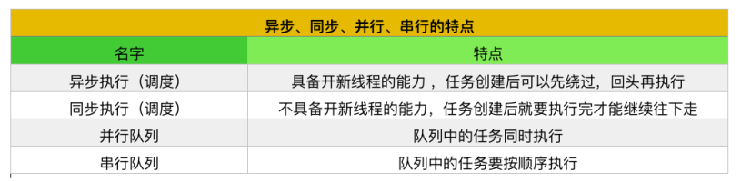

# GCDTest
GCD  异步／同步 主队列／全局队列／ 队列组／栅栏 ／信号量 测试
##前言
对初学者来说，GCD似乎是一道迈不过去的坎，很多人在同步、异步、串行、并行和死锁这几个名词的漩涡中渐渐放弃治疗。本文将使用图文表并茂的方式给大家形象地解释其中的原理和规律。

##线程、任务和队列的概念

##异步、同步 & 并行、串行的特点


一条重要的准则
一般来说，我们使用GCD的最大目的是在新的线程中同时执行多个任务，这意味着我们需要两项条件：

能开启新的线程
任务可以同时执行
结合以上两个条件，也就等价“开启新线程的能力 + 任务同步执行的权利”，只有在满足能力与权利这两个条件的前提下，我们才可以在同时执行多个任务。

所有组合的特点


##（一）异步执行 + 并行队列
实现代码：
```objc
//异步执行 + 并行队列
- (void)asyncConcurrent{
//创建一个并行队列
dispatch_queue_t queue = dispatch_queue_create("标识符", DISPATCH_QUEUE_CONCURRENT);

NSLog(@"---start---");

//使用异步函数封装三个任务
dispatch_async(queue, ^{
NSLog(@"任务1---%@", [NSThread currentThread]);
});
dispatch_async(queue, ^{
NSLog(@"任务2---%@", [NSThread currentThread]);
});
dispatch_async(queue, ^{
NSLog(@"任务3---%@", [NSThread currentThread]);
});

NSLog(@"---end---");
}
```


打印结果：
---start---
---end---
任务3---{number = 5, name = (null)}
任务2---{number = 4, name = (null)}
任务1---{number = 3, name = (null)}
解释
异步执行意味着
可以开启新的线程
任务可以先绕过不执行，回头再来执行
并行队列意味着
任务之间不需要排队，且具有同时被执行的“权利”
两者组合后的结果
开了三个新线程
函数在执行时，先打印了start和end，再回头执行这三个任务
这三个任务是同时执行的，没有先后，所以打印结果是“任务3-->任务2-->任务1”

步骤图


##（二）异步执行 + 串行队列
实现代码：
//异步执行 + 串行队列
```objc
- (void)asyncSerial{
//创建一个串行队列
dispatch_queue_t queue = dispatch_queue_create("标识符", DISPATCH_QUEUE_SERIAL);

NSLog(@"---start---");
//使用异步函数封装三个任务
dispatch_async(queue, ^{
NSLog(@"任务1---%@", [NSThread currentThread]);
});
dispatch_async(queue, ^{
NSLog(@"任务2---%@", [NSThread currentThread]);
});
dispatch_async(queue, ^{
NSLog(@"任务3---%@", [NSThread currentThread]);
});
NSLog(@"---end---");
}
```

打印结果：
---start---
---end---
任务1---{number = 3, name = (null)}
任务2---{number = 3, name = (null)}
任务3---{number = 3, name = (null)}
解释
异步执行意味着
可以开启新的线程
任务可以先绕过不执行，回头再来执行
串行队列意味着
任务必须按添加进队列的顺序挨个执行
两者组合后的结果
开了一个新的子线程
函数在执行时，先打印了start和end，再回头执行这三个任务
这三个任务是按顺序执行的，所以打印结果是“任务1-->任务2-->任务3”
步骤图


##（三）同步执行 + 并行队列
实现代码：
```objc
//同步执行 + 并行队列
- (void)syncConcurrent{
//创建一个并行队列
dispatch_queue_t queue = dispatch_queue_create("标识符", DISPATCH_QUEUE_CONCURRENT);

NSLog(@"---start---");
//使用同步函数封装三个任务
dispatch_sync(queue, ^{
NSLog(@"任务1---%@", [NSThread currentThread]);
});
dispatch_sync(queue, ^{
NSLog(@"任务2---%@", [NSThread currentThread]);
});
dispatch_sync(queue, ^{
NSLog(@"任务3---%@", [NSThread currentThread]);
});
NSLog(@"---end---");
}
```


打印结果：
---start---
任务1---{number = 1, name = main}
任务2---{number = 1, name = main}
任务3---{number = 1, name = main}
---end---
解释
同步执行执行意味着
不能开启新的线程
任务创建后必须执行完才能往下走
并行队列意味着
任务必须按添加进队列的顺序挨个执行
两者组合后的结果
所有任务都只能在主线程中执行
函数在执行时，必须按照代码的书写顺序一行一行地执行完才能继续
注意事项
在这里即便是并行队列，任务可以同时执行，但是由于只存在一个主线程，所以没法把任务分发到不同的线程去同步处理，其结果就是只能在主线程里按顺序挨个挨个执行了
步骤图


##（四）同步执行+ 串行队列
实现代码：
```objc
- (void)syncSerial{
//创建一个串行队列
dispatch_queue_t queue = dispatch_queue_create("标识符", DISPATCH_QUEUE_SERIAL);

NSLog(@"---start---");
//使用异步函数封装三个任务
dispatch_sync(queue, ^{
NSLog(@"任务1---%@", [NSThread currentThread]);
});
dispatch_sync(queue, ^{
NSLog(@"任务2---%@", [NSThread currentThread]);
});
dispatch_sync(queue, ^{
NSLog(@"任务3---%@", [NSThread currentThread]);
});
NSLog(@"---end---");
}
```

打印结果：
---start---
任务1---{number = 1, name = main}
任务2---{number = 1, name = main}
任务3---{number = 1, name = main}
---end---
解释:这里的执行原理和步骤图跟“同步执行+并发队列”是一样的，只要是同步执行就没法开启新的线程，所以多个任务之间也一样只能按顺序来执行，

##（五）异步执行+主队列
实现代码：
```objc
- (void)asyncMain{
//获取主队列
dispatch_queue_t queue = dispatch_get_main_queue();

NSLog(@"---start---");
//使用异步函数封装三个任务
dispatch_async(queue, ^{
NSLog(@"任务1---%@", [NSThread currentThread]);
});
dispatch_async(queue, ^{
NSLog(@"任务2---%@", [NSThread currentThread]);
});
dispatch_async(queue, ^{
NSLog(@"任务3---%@", [NSThread currentThread]);
});
NSLog(@"---end---");
}
```
打印结果：
---start---
---end---
任务1---{number = 1, name = main}
任务2---{number = 1, name = main}
任务3---{number = 1, name = main}
解释
异步执行意味着
可以开启新的线程
任务可以先绕过不执行，回头再来执行
主队列跟串行队列的区别
队列中的任务一样要按顺序执行
主队列中的任务必须在主线程中执行，不允许在子线程中执行
以上条件组合后得出结果：
所有任务都可以先跳过，之后再来“按顺序”执行
步骤图


##（六）同步执行+主队列（死锁）
实现代码：
```objc
- (void)syncMain{
//获取主队列
dispatch_queue_t queue = dispatch_get_main_queue();

NSLog(@"---start---");
//使用同步函数封装三个任务
dispatch_sync(queue, ^{
NSLog(@"任务1---%@", [NSThread currentThread]);
});
dispatch_sync(queue, ^{
NSLog(@"任务2---%@", [NSThread currentThread]);
});
dispatch_sync(queue, ^{
NSLog(@"任务3---%@", [NSThread currentThread]);
});
NSLog(@"---end---");
}
```
打印结果：
---start---
解释
主队列中的任务必须按顺序挨个执行
任务1要等主线程有空的时候（即主队列中的所有任务执行完）才能执行
主线程要执行完“打印end”的任务后才有空
“任务1”和“打印end”两个任务互相等待，造成死锁
步骤图

